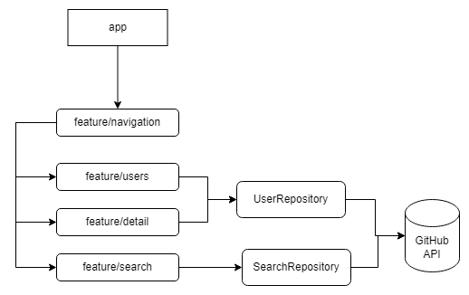

### GitHub App

## Tech stacks & Libs

- Kotlin with Coroutines + Flow
- Jetpack
    - Lifecycle
    - ViewModel
    - Compose
    - Hilt
    - Navigation
- Architecture
    - MVVM Architecture
    - Clean Architecture Pattern
- Coil Compose
- Material 3
- Network
  - Retrofit
  - Gson
  - OkHttp Logging
- Unit Tests
  - [Mockk](https://mockk.io/ANDROID.html)
  - JUnit4
  - Kotlin Coroutine Tests
  - [Turbine](https://github.com/cashapp/turbine)
- Instrumented Tests
  - [Compose UI Test](https://developer.android.com/jetpack/compose/testing)

## App Modules Organization

The Home App consume only the `features/navigation` package. This package is responsible for launch screens based on navigation.
The `features/users` and `features/detail` use the `UserRepository` to consume the `RemoteDataSource` and have access to the GitHub data.
The UserRepository is an interface that have an injection of `RemoteDataSource` on it.

## App Architecture Overview

This is a Google recommendation architecture and I used it in this project.
The `UILayer` calls DataLayer directly because there was no business rule to be applied on, so I skipped this layer.
The `DataLayer` have some repositories and those calls `RemoteDataSources` to fetch data into the app.

## Instructions to run

- Add your github personal key to the file `credential.properties`
  - This file have a key called `githubToken` and you need to add your key in there. Otherwise, the app could not work as expected.

- Make sure you have Java17 installed
  - If not, go to File -> Settings -> Search for Gradle -> on Gradle SDK select any Java17 option
- To run the app just hit play in AS
- To run unit tests `./gradlew test` or run the gradle `testDebugUnitTest` task on AS UI 
- To run instrumented tests `./gradlew connectedAndroidTest` or run the gradle `connectedDebugAndroidTest` task on AS UI

